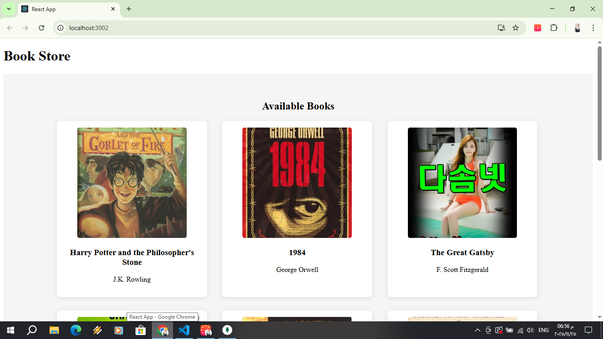
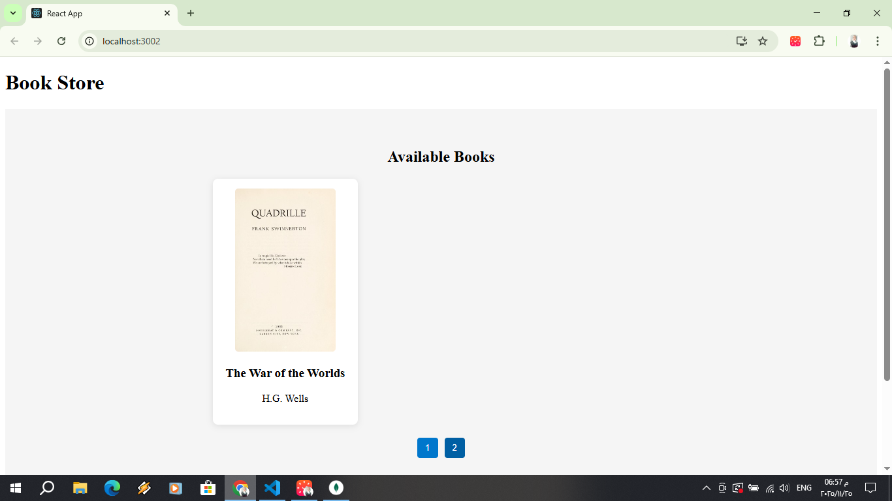
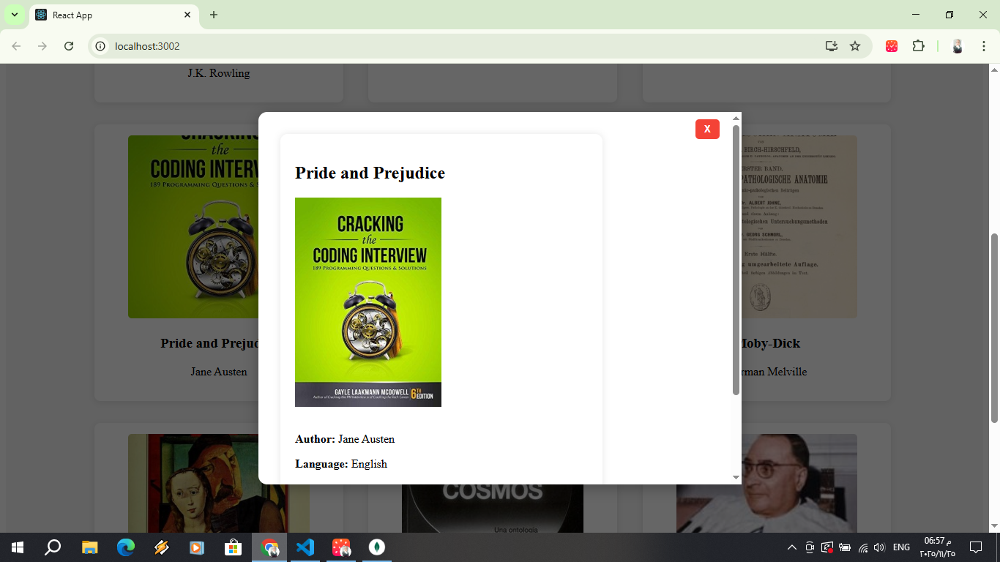

# CyberGuardX Front Task 4
 Build an interactive and modern user interface for a bookstore project.

## Technologies Used

- JavaScript 
- React
- CSS 

## Project Structure

- `client/` — Front-end code  
- `server/` — Backend code


##  Getting Started

Follow these steps to run the project locally:

1. **Clone the repository:**
   ```bash
   git clone https://github.com/alaafawzyyyy/CyberGuardX-Front-Task4.git

2. **Navigate to the backend folder:**
   ```bash
    cd CyberGuardX-Front-Task4/server

3. **Install dependencies:**
   ```bash
    npm install

4. **Start the development server:**
   ```bash
    npm run dev

5. **Navigate to the fronend folder:**
   ```bash
    cd CyberGuardX-Front-Task4/client

3. **Install dependencies:**
   ```bash
    npm install

4. **Start the development server:**
   ```bash
    npm start

## Screenshots



